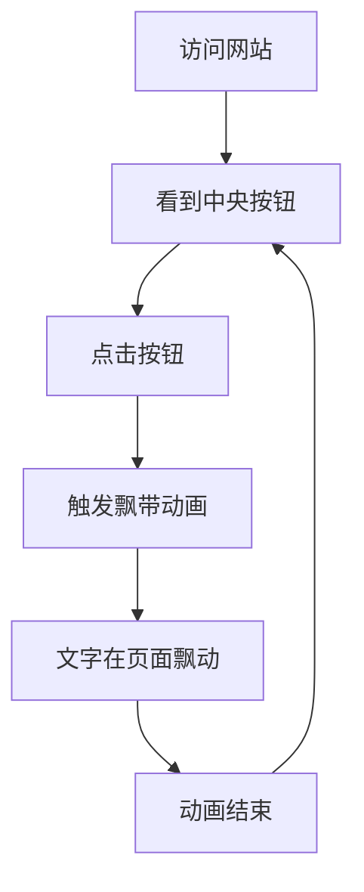

## 1. Product Overview
一个简单的静态网站，点击按钮后显示飘带效果的hello world文字动画。
- 主要功能：点击按钮触发飘带动画效果
- 目标用户：希望在GitHub Pages上展示简单交互效果的开发者

## 2. Core Features

### 2.1 User Roles
| Role | Registration Method | Core Permissions |
|------|---------------------|------------------|
| Visitor | 无需注册 | 浏览网站，点击按钮触发动画 |

### 2.2 Feature Module
1. **Home page**: 中央按钮，点击后显示飘带效果的hello world文字

### 2.3 Page Details
| Page Name | Module Name | Feature description |
|-----------|-------------|---------------------|
| Home page | 中央按钮 | 显示"点击我"文字，点击后触发飘带动画 |
| Home page | 飘带动画 | 点击按钮后，在整个页面显示大大的hello world文字，像飘带一样在窗口里飘来飘去 |

## 3. Core Process
用户访问网站 → 点击中央按钮 → 触发飘带动画效果 → 文字在页面中飘动 → 动画结束后可再次点击按钮

## 4. User Interface Design
### 4.1 Design Style
- 主色调：#6366f1（靛蓝色）、#f43f5e（玫瑰红）
- 按钮样式：圆角按钮，悬停效果，有轻微阴影
- 字体：使用现代无衬线字体，标题使用较大字号
- 布局风格：简洁现代，居中布局
- 动画风格：流畅的飘带效果，带有轻微的旋转和缩放

### 4.2 Page Design Overview
| Page Name | Module Name | UI Elements |
|-----------|-------------|-------------|
| Home page | 中央按钮 | 居中显示，白色背景，靛蓝色文字，悬停时变为玫瑰红，有轻微阴影和缩放效果 |
| Home page | 飘带动画 | 大号文字，渐变色，带有旋转和飘动效果，在页面中随机路径移动 |

### 4.3 Responsiveness
- 桌面优先设计，同时适配移动设备
- 按钮大小和文字大小会根据屏幕尺寸自动调整
- 动画效果在不同设备上保持一致的视觉体验

### 4.4 3D Scene Guidance
- 不适用，本项目为2D动画效果