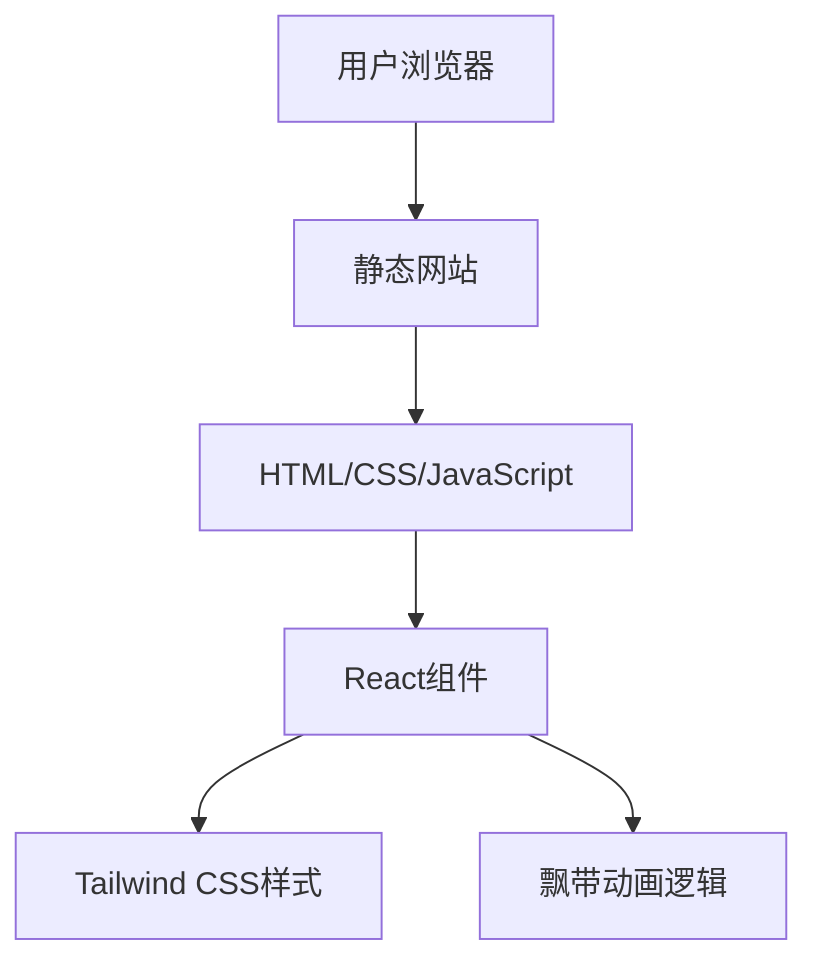

## 1. Architecture Design


## 2. Technology Description
- Frontend: React@18 + tailwindcss@3 + vite
- Initialization Tool: vite-init
- Backend: None (静态网站)
- Database: None (静态网站)

## 3. Route Definitions
| Route | Purpose |
|-------|---------|
| / | Home page with central button and ribbon animation |

## 4. API Definitions
- 不适用，本项目为静态网站，无API调用

## 5. Server Architecture Diagram
- 不适用，本项目为静态网站，无服务器架构

## 6. Data Model
- 不适用，本项目为静态网站，无数据模型

## 7. Implementation Details
### 7.1 Project Structure
```
/
├── public/
│   └── favicon.ico
├── src/
│   ├── components/
│   │   └── RibbonAnimation.tsx
│   ├── App.tsx
│   ├── main.tsx
│   └── index.css
├── .gitignore
├── index.html
├── package.json
├── tailwind.config.js
└── vite.config.ts
```

### 7.2 Key Components
1. **App.tsx**: 主应用组件，包含中央按钮和飘带动画组件
2. **RibbonAnimation.tsx**: 实现飘带效果的动画组件

### 7.3 Animation Implementation
- 使用CSS动画和JavaScript结合实现飘带效果
- 文字会在页面中随机路径移动，带有旋转和缩放效果
- 动画持续时间约为5-10秒，结束后可再次点击按钮触发

### 7.4 Deployment
- 部署到GitHub Pages，使用gh-pages包进行部署
- 构建命令：`npm run build`
- 部署命令：`npm run deploy`